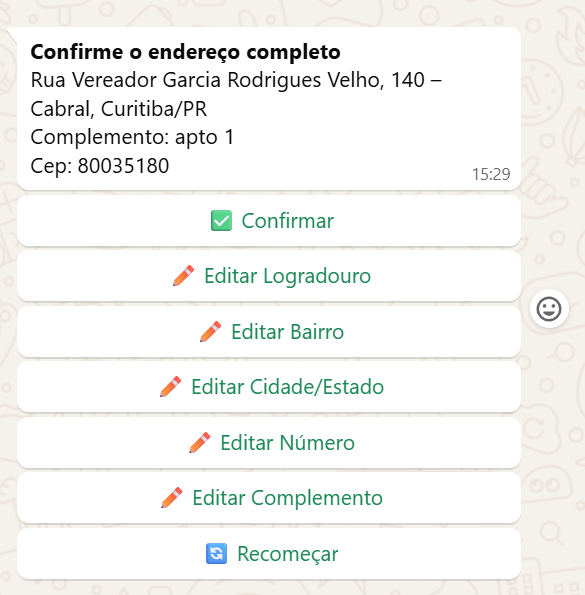

# Ocorrência pelo WhatsApp

### Módulo de Ocorrências via WhatsApp
### 1. Visão Geral e Objetivos (O "PORQUÊ")

#### 1.1. Problema
Atualmente, o registro de ocorrências em condomínios é descentralizado e ineficiente. Moradores utilizam canais informais (WhatsApp pessoal do síndico, e-mail, interfone), gerando falta de rastreabilidade, dificuldade de priorização para o síndico e incerteza para o morador sobre o andamento de sua solicitação. A falta de um consentimento formal para o tratamento de dados (LGPD) também representa um risco legal.
#### 1.2. Solução Proposta
Implementar um canal de comunicação oficial via WhatsApp para o registro e consulta de ocorrências. Um chatbot guiará o morador, coletando as informações necessárias e registrando-as diretamente no back-office existente. O sistema exigirá o aceite dos Termos de Uso e Política de Privacidade na primeira interação e notificará o morador proativamente sobre o andamento de suas solicitações.

#### 1.3. Objetivos de Negócio e KPIs
*   Aumentar a eficiência do síndico ao reduzir o tempo gasto com comunicação informal.
*   Melhorar a satisfação do morador através de um canal ágil e transparente.
*   Garantir conformidade com a LGPD através do registro de consentimento.
*   Fazer os moradores a usarem a plataforma

| KPI | Métrica de Sucesso |
| ---| --- |
| Taxa de Canalização | 50% das novas ocorrências registradas via WhatsApp após 3 meses. |
| Tempo Médio de Resolução | Redução de 25% no tempo entre o registro e a resolução. |
| NPS / CSAT do Morador | Obter uma nota de satisfação média > 8/10 nas pesquisas pós-resolução. |
| Taxa de Adoção | \> 70% dos moradores ativos no sistema após 6 meses. |
| Taxa de Sucesso do Bot | \> 85% das interações iniciadas resultam em ocorrência criada ou consulta realizada com sucesso. |

### 2. Jornadas do Usuário e Fluxos Conversacionais
A interação será guiada por um assistente virtual (chatbot).
#### 2.1. Jornada resumida
*   Aceite de Termos de Uso
    *   E informando que é maior do que 18.
        *   Se informar que é menor de 18. Não permitir o cadastro.
*   Cadastro pelo Whatsapp para não cadastrados
    *   Dados que vamos pedir:
        *   Nome
        *   Bloco
        *   Unidade
        *   email
        *   telefone o bot pode pegar direto do contato
*   Confirmação de dados do cadastro feito por síndico
    *   Morador pode alterar qualquer campo (exemplo usar os dados do nosso sistema)
    *   
*   Usuário não liberado pelo síndico → Recebe msg de aguardando liberação → enviar msg pro sindico que precisa liberar alguém
*   Usuário liberado vai pro fluxo de cadastro de ocorrencia
*   Usuário liberado por visualizar ocorrencias já abertas e status delas
*   Usuário recebe info pró-ativa de ocorrências que tem comentários ou mudam de status.
### Componentes Reutilizáveis (Snippets)
Estes são blocos de texto que serão inseridos em múltiplos fluxos.
#### Snippet A: Alerta de Emergência

> **⚠️ ATENÇÃO: EM CASO DE EMERGÊNCIA, NÃO USE ESTE CANAL.**  
> Para situações como vazamentos de gás, incêndios, problemas graves de segurança ou emergências médicas, LIGUE IMEDIATAMENTE para \[Número de Emergência do Condomínio\].
* * *
#### \[Esse número de emergencia vamos ter que cadastrar em algum local - sugestão no cadastro da sindicatura\]
#### Snippet B: Convite para Baixar o Aplicativo
* * *
> ✨ DICA: Quer uma experiência completa? Baixe o app da **Zind**!  
> Pelo aplicativo, além das ocorrências, você pode reservar áreas comuns, ver os avisos do síndico e muito mais.  
> 📲 Baixe agora:  
> • Android: \[Link para a Google Play Store\]  
> • iPhone: \[Link para a Apple App Store\]
#### Fluxo 0: Onboarding e Aceite de Termos (Primeiro Uso) - PARA TODOS, MESMO PRÉ-CADASTRADOS
*   Condição: Termos de Uso atual não aceito (termos de uso podem ser atualizados).
*   Gatilho: Primeira mensagem de um número de telefone válido, mas que ainda não aceitou os termos.
> 👤 **Morador**: Olá  
> 🤖 **Assistente Virtual:** Olá, \[Nome do Morador\]! Sou a assistente virtual do Condomínio \[Nome do Condomínio\]. Que bom te ver por aqui! Para começarmos e garantirmos a transparência e a segurança das suas informações, você precisa ler e aceitar nossos Termos de Uso e nossa Política de Privacidade.  
> Você pode consultá-los aqui:  
> 🔗 Termos de Uso: (link)  
> 🔒 Política de Privacidade: (link)  
> Ao aceitar, você também declara ser maior de 18 anos. Para confirmar e ativar seu acesso, por favor.  
> Aceito (Botão)  
> Não aceito (Botão)

👤 Morador: Não Aceito
🤖 Assistente Virtual:
Entendido.
Para garantir a segurança de todos e a conformidade com a Lei Geral de Proteção de Dados (LGPD), o aceite dos termos é um passo necessário para podermos processar suas solicitações por este canal.
Como os termos não foram aceitos, não posso dar continuidade ao seu atendimento.
Se você mudar de ideia no futuro, basta me enviar um "Olá" novamente para recomeçar o processo. Tenha um ótimo dia!

* * *
> 👤 **Morador**: aceito
* * *
> 🤖 **Assistente Virtual:** Ótimo, obrigado por confirmar!  
> Seus termos foram aceitos com sucesso. ✅

**Se primeira vez e tem pré-cadastro: 1.1. Fluxo A**
**Se primeira vez e não tem cadastro: 1.1. Fluxo B**

### 1\. Fluxos de Entrada e Cadastro (Onboarding)
#### 1.1. Fluxo A: Confirmação de Pré-Cadastro
*   Gatilho: Usuário pré-cadastrado pelo síndico (status `pré-cadastrado`) envia a primeira mensagem.
> 🤖 Assistente Virtual: Olá!  
> Identifiquei que a administração do Condomínio \[Nome do Condomínio\] iniciou seu cadastro em nosso canal de ocorrências. Seja bem-vindo(a)!  
> Para ativarmos seu acesso, por favor, confirme se os dados abaixo estão corretos:  
> • Nome: \[Nome do Morador do BD\]  
> • E-mail: \[Email do Morador do BD\]  
> • Bloco \[Bloco BD\]  
> Unidade: \[Unidade BD\]  
> As informações estão corretas?  
> 1️⃣   Sim, estão corretas \[botão\]  
> 2️⃣   Não, quero corrigir \[botão\]
*   Se o morador escolher "2" (Não, quero corrigir):
**🤖 Assistente Virtual:**
Entendido. O que quer corrigir?
*   Se o morador escolher "1" (Sim, estão corretas):

→ Ir para o passo de Fluxo de Registro de ocorrência.
Abrir menu semelhante ao da sugestão dada a cima e fazer o usuário fazer o cadastro
#### 1.1. Fluxo B: Solicitação de Cadastro (Usuário Desconhecido)

*   Gatilho: Número não encontrado no sistema envia uma mensagem.
> 🤖 Assistente Virtual: Olá! Bem-vindo(a) ao canal oficial do Condomínio \[Nome do Condomínio\].  
> `[INSERIR SNIPPET A: ALERTA DE EMERGÊNCIA]`  
> Vejo que este é seu primeiro acesso. Para solicitar seu cadastro, preciso de algumas informações. Primeiro, seu Nome Completo, por favor.  
> 🤖 Assistente Virtual: Obrigado, \[Nome do Morador\]. Agora, seu melhor e-mail.  
> 🤖 Assistente Virtual: Perfeito. Agora, vamos à sua unidade. Por favor, informe o bloco. (Ex: A, B, Villa, etc.)  
> 🤖 Assistente Virtual: Ótimo. Agora, por favor, digite o número do seu apartamento ou casa ou unidade (Ex: 502, 104, etc.)  
> 🤖 Assistente Virtual: Ótimo. Só para confirmar as informações:  
> • Nome: \[Nome informado\]  
> • E-mail: \[Email informado\]  
> • Bloco: \[Bloco informado\]  
> • Unidade \[Unidade informada\]  
> As informações estão corretas?
> \[Usar aqueles botões tipo da sugestão para deixar moradores decidirem o que querem mudar ou confimar\]
*   Se o clicou em "Confirmar":
> 🤖 Assistente Virtual: Perfeito! ✅  
> Sua solicitação de cadastro foi enviada com sucesso para a administração do condomínio. Você receberá uma nova mensagem por aqui assim que seu acesso for aprovado. Geralmente, isso leva algumas horas. Agradecemos a sua paciência!

#### 2\. Registro de Nova Ocorrência
*   Gatilho: Usuário escolhe a opção "1" no menu principal.

> Agora sim, podemos começar! Como posso ajudar hoje?
> 1️⃣   🆕 Registrar Nova Ocorrência \[botão\]
> 2️⃣   🔎 Consultar Minhas Ocorrências \[botão\]

**Caso seja digitado 1:**
> 🤖 Assistente Virtual:  
> Entendido. Para iniciar o registro, por favor, descreva em detalhes o que aconteceu. Tente incluir o local exato, se possível. _Ex: O elevador social do Bloco A não está funcionando._
* * *
> 👤 Morador: Vazamento de água no teto da garagem, próximo à vaga 42.
* * *
> 🤖 Assistente Virtual: Ótimo, obrigado pela descrição. Se tiver uma foto que ajude a ilustrar o problema, pode me enviar agora. Caso não tenha, é só selecionar "não tenho".  
> (botão) Não tenho → Vai para fluxo 2
* * *
> 👤 Morador: (envia arquivo `foto.jpg`)
* * *
> 🤖 Assistente Virtual: Perfeito, imagem recebida! Sua ocorrência foi registrada com sucesso. A equipe de gestão já foi acionada.  
> ✅ #2025-G42-001  
> **Você será notificado por aqui sobre cada andamento.**  
>   
> \[INSERIR SNIPPET B: CONVITE PARA BAIXAR O APP\]
Se precisar de uma regra para formar protocolo, podemos seguir YYYYMMDDHHMMSS-ID\_CONDOMINIO (pode ser outra se tiverem outra ideia melhor)
#### Fluxo 2: Consulta de Ocorrências
*   Gatilho: Usuário escolhe a opção "2" no menu principal.
> _🤖 Assistente Virtual: Verifiquei aqui e você possui as seguintes ocorrências:_  
> _⚙️ EM ANDAMENTO_  
> **_Protocolo: #2025-G42-001_**  
> **_Data de Abertura:_** _25-jan-2025 10h34_  
> **_Última Atualização:_** _28-jan-2025 12h23_  
> **_Descrição:_** _Vazamento de água no teto da garagem..._  
> **_Comentários_**  
> **_25-jan-2025 13h15:_** _Lucileia Moraes: Algum comentário aqui que vai ter que dar duas ou mais linhas quadradinhas_  
> **_25-jan-2025 16h23:_** _Abrão Lincoln Menezes: Qualquer comentário que foi colocado (subiu uma foto) e também ocupou mais de uma linha._  
> **_25-jan-2025 16h23:_** _Lucileia Moraes: Vamos estar averiguando qualquer comentário para ter mais de uma linha._  
> (Segunda msg - cada ocorrência é uma msg)  
> **_Protocolo: #2025-G42-001_**  
> **_Data de Abertura:_** _25-jan-2025 10h34_  
> **_Última Atualização:_** _28-jan-2025 12h23_  
> **_Descrição:_** _Vazamento de água no teto da garagem..._  
> **_Comentários_**  
> **_25-jan-2025 13h15:_** _Lucileia Moraes: Algum comentário aqui que vai ter que dar duas ou mais linhas quadradinhas_  
> **_25-jan-2025 16h23:_** _Abrão Lincoln Menezes: Qualquer comentário que foi colocado (subiu uma foto) e também ocupou mais de uma linha._  
> **_25-jan-2025 16h23:_** _Lucileia Moraes: Vamos estar averiguando qualquer comentário para ter mais de uma linha._
_⚙️ AGUARDANDO RESPOSTA_
> **_Protocolo: #2025-G42-001_**  
> **_Data de Abertura:_** _25-jan-2025 10h34_  
> **_Última Atualização:_** _28-jan-2025 12h23_  
> **_Descrição:_** _Vazamento de água no teto da garagem..._  
> **_Comentários_**  
> **_25-jan-2025 13h15:_** _Lucileia Moraes: Algum comentário aqui que vai ter que dar duas ou mais linhas quadradinhas_  
> **_25-jan-2025 16h23:_** _Abrão Lincoln Menezes: Qualquer comentário que foi colocado (subiu uma foto) e também ocupou mais de uma linha._  
> **_25-jan-2025 16h23:_** _Lucileia Moraes: Vamos estar averiguando qualquer comentário para ter mais de uma linha._  
> (Outra msg)  
> _Se desejar registrar uma nova ocorrência, digite 1._
*   Se o morador não tiver ocorrências:
> 🤖 Assistente Virtual: Boas notícias! Verifiquei aqui e você não possui nenhuma ocorrência em aberto no momento. 😊

#### Fluxo 3: Notificações Proativas (Iniciadas pelo Sistema)
#### 3.1. Aprovação de Cadastro (Conclusão do Fluxo C)

> 🤖 Assistente Virtual: Ótimas notícias, \[Nome do Morador\]!  
> 🎉 Seu cadastro para a unidade \[Bloco e Unidade\] foi APROVADO pela administração.  
> A partir de agora, você já pode registrar e acompanhar ocorrências por aqui.  
> Seja muito bem-vindo(a)!  
> Como posso ajudar hoje?  
> 1️⃣   🆕 Registrar Nova Ocorrência  
> 2️⃣   🔎 Consultar Minhas Ocorrências
#### 3.2. Rejeição de Cadastro (Conclusão do Fluxo C)
> 🤖 Assistente Virtual: Olá, \[Nome do Morador\].  
> A administração analisou sua solicitação de cadastro para a unidade \[Bloco e Unidade\] e não pôde aprová-la no momento.  
> Por favor, entre em contato diretamente com a administração para esclarecer a situação.

#### 3.3. Atualização de Status de Ocorrência
> 🤖 Assistente Virtual: Olá, \[Nome do Morador\].  
> Tenho uma atualização sobre sua ocorrência! Referente a:  
> **Protocolo: #2025-G42-001**  
> "Vazamento de água no teto da garagem..."  
> **Novo Status:** ✅ RESOLVIDA  
> **Comentário da gestão:** "A equipe de manutenção identificou e reparou o cano no andar superior. A área foi limpa."

#### Fluxo 4: Tratamento de Erros

> 👤 Morador: qual o telefone do síndico  
> 🤖 Assistente Virtual: Desculpe, não entendi essa opção. Por favor, escolha um dos itens do menu digitando o número correspondente.  
> 1️⃣   🆕 Registrar Nova Ocorrência 2️⃣   🔎 Consultar Minhas Ocorrências

* * *
#### Fluxo 5: Falhas de Autenticação / Identificação do Usuário
A qualquer momento
**O Back-Office está fora do ar DURANTE a autenticação.**
*   Causa Provável: O serviço de integração tenta chamar a API, mas o servidor do back-office retorna um erro 5xx (Server Error) ou a requisição sofre timeout.
*   Experiência do Usuário (UX - A Mensagem):
> 🤖 Assistente Virtual: Olá! No momento, estamos com uma instabilidade em nossos sistemas e não consigo verificar seus dados para começar. Nossa equipe técnica já foi alertada.  
> Por favor, tente novamente em alguns minutos. Pedimos desculpas pelo transtorno.
*   **Ação Técnica (DEV):**
    *   O serviço de integração deve registrar (log) o erro detalhado (código 5xx, timeout).
    *   Configurar um alerta automático (ex: via Sentry, PagerDuty) para a equipe de desenvolvimento sobre a indisponibilidade da API do back-office.
#### Falhas no Processo de Criação da Ocorrência
**O usuário envia um formato de arquivo não suportado.**
*   Causa Provável: O usuário envia um documento `.pdf`, um arquivo `.zip` ou qualquer outro formato que não seja uma imagem ou vídeo.
*   Experiência do Usuário (UX - A Mensagem):
> 🤖 Assistente Virtual: Opa! O arquivo que você enviou não parece ser uma imagem.  
> Por favor, envie um arquivo nos formatos .jpg, .png. Se não tiver uma mídia para enviar, é só selecionar "não tenho" (botão)
*   Ação Técnica (DEV):
    *   O serviço de integração deve validar a extensão e o tipo MIME (MIME type) do arquivo recebido pela API do WhatsApp.
    *   Rejeitar o arquivo e enviar a mensagem de instrução, mantendo o usuário no mesmo passo do fluxo.
Agencia de Estratégia de Produto de Elite Flutter
Gem personalizado
Mostrar raciocínio

Excelente pergunta. Tratar os "caminhos não felizes" (unhappy paths) é o que diferencia um produto bom de um produto de elite. É sobre antecipar falhas e garantir que, mesmo quando algo dá errado, a experiência do usuário seja gerenciada com clareza e empatia, e que o sistema se comporte de maneira previsível e segura.
Ativando os modos PM, Designer e DEV para mapear e especificar esses cenários.
* * *
#### 4\. **Opção de Feedback Pós-Resolução**
Após a resolução de uma ocorrência, o sistema deve solicitar feedback ao morador.

*   **Mensagem do Bot:**
> _🤖 Assistente Virtual: Sua ocorrência \[Protocolo: #2025-G42-001\] foi resolvida!_  
> _Gostaríamos de saber sua opinião:_  
> _1️⃣ Excelente_  
> _2️⃣ Bom_  
> _3️⃣ Regular_  
> _4️⃣ Ruim_  
> _5️⃣ Péssimo_  
> _Se desejar, você também pode enviar um comentário adicional._  
> Quero fazer um comentário \[botão\]
Morador envia comentário
> Muito obrigado pelo seu comentário!

### Estratégia para Caminhos Não Felizes

O princípio fundamental é: nunca deixar o usuário em um beco sem saída e nunca perder seus dados. Cada mensagem de erro deve seguir a regra "O que aconteceu, Por que (se possível), O que fazer agora".
Vamos categorizar as falhas por ponto de origem:

#### 1\. Falhas de Autenticação / Identificação do Usuário
_Cenário 1.1: O Back-Office está fora do ar DURANTE a autenticação._
*   Causa Provável: O serviço de integração tenta chamar a API `GET /api/v1/moradores/por-whatsapp/{numero}`, mas o servidor do back-office retorna um erro 5xx (Server Error) ou a requisição sofre timeout.
*   Experiência do Usuário (UX - A Mensagem):
> 🤖 Assistente Virtual: Olá! No momento, estamos com uma instabilidade em nossos sistemas e não consigo verificar seus dados para começar. Nossa equipe técnica já foi alertada.  
> Por favor, tente novamente em alguns minutos. Pedimos desculpas pelo transtorno.
*   Ação Técnica (DEV):
    *   O serviço de integração deve registrar (log) o erro detalhado (código 5xx, timeout).
    *   Configurar um alerta automático (ex: via Sentry, PagerDuty) para a equipe de desenvolvimento sobre a indisponibilidade da API do back-office.
* * *
#### 2\. Falhas no Processo de Criação da Ocorrência
_Cenário 2.1: O usuário envia um formato de arquivo não suportado._
*   Causa Provável: O usuário envia um documento `.pdf`, um arquivo `.zip` ou qualquer outro formato que não seja uma imagem ou vídeo.
*   Experiência do Usuário (UX - A Mensagem):
> 🤖 Assistente Virtual: Opa! O arquivo que você enviou não parece ser uma imagem ou vídeo.  
> Por favor, envie um arquivo nos formatos .jpg, .png, .gif ou .mp4. Se não tiver uma mídia para enviar, é só digitar "não tenho".
*   Ação Técnica (DEV):
    *   O serviço de integração deve validar a extensão e o tipo MIME (MIME type) do arquivo recebido pela API do WhatsApp.
    *   Rejeitar o arquivo e enviar a mensagem de instrução, mantendo o usuário no mesmo passo do fluxo.

_Cenário 2.2: Falha ao fazer upload da mídia para o storage (ex: S3)._
*   Causa Provável: O serviço de storage (Amazon S3, Google Cloud Storage) está indisponível ou há um problema de permissão.
*   Experiência do Usuário (UX - A Mensagem):
> 🤖 Assistente Virtual: Recebi seu arquivo, mas estou com um problema para processá-lo no momento.  
> Vamos fazer assim: vou registrar sua ocorrência apenas com a descrição em texto por enquanto, para não perdermos sua solicitação, ok?  
> _(O bot então prossegue para o passo de confirmação sem a mídia)_
*   Ação Técnica (DEV):
    *   Registrar o erro de upload.
    *   Prosseguir com o fluxo, chamando a API de criação de ocorrência com o campo `media_urls` vazio ou nulo.
    *   É crucial informar ao usuário que a mídia não foi salva para gerenciar suas expectativas.

_Cenário 2.3: O Back-Office está fora do ar DURANTE o registro da ocorrência._
*   Causa Provável: O bot já coletou todos os dados (descrição, mídia), mas ao chamar a API, o servidor retorna um erro 5xx. Este é o cenário mais crítico, pois há risco de perda de dados do usuário.
*   Experiência do Usuário (UX - A Mensagem):
> 🤖 Assistente Virtual: Estou quase lá! Tivemos um problema de comunicação com o sistema principal para finalizar o registro da sua ocorrência.  
> Mas não se preocupe, suas informações foram salvas! 👍  
> Vou continuar tentando registrar sua solicitação automaticamente. Você receberá uma nova mensagem com o número do protocolo assim que o sistema se restabelecer.
*   Ação Técnica (DEV):
    *   Implementar uma Fila de Retentativa (Retry Queue): O serviço de integração NÃO deve descartar a requisição. Ele deve salvá-la em uma fila ou em um banco de dados temporário.
    *   Um processo em background tentará reenviar a ocorrência para a API do back-office em intervalos progressivos (ex: usar Fibonacci em minutos).
    *   Quando o registro for bem-sucedido, o sistema dispara a mensagem de confirmação para o usuário com o protocolo.
    *   Se após X tentativas ainda falhar, um alerta final deve ser enviado para a equipe de suporte para intervenção manual.

_Cenário 2.4. Falhas de Input e Comportamento do Usuário_
*   O usuário para de responder no meio de um fluxo (Timeout).
*   Causa Provável: O usuário se distraiu ou fechou o WhatsApp. O bot está aguardando uma resposta (ex: a descrição da ocorrência).
*   Experiência do Usuário (UX - A Mensagem):
    *   Após 5 minutos de inatividade:
> 🤖 Assistente Virtual: Olá! Você ainda está por aí? Se precisar de ajuda para continuar o registro, é só me chamar. Vou aguardar mais um pouco.
*       *   Após 15 minutos de inatividade:
> 🤖 Assistente Virtual: Parece que você precisou sair. Estou encerrando nossa conversa por inatividade para não te atrapalhar.  
> Se precisar de algo, é só mandar um "Olá" para começarmos de novo!
*   Ação Técnica (DEV):
    *   Implementar um gerenciador de estado de sessão com temporizadores (timers).
    *   Limpar o estado da sessão do usuário após o timeout final para lib

#### 2.4ro istde versão de termos e data de aceite pelo morador
`Moradores` - data e hora do aceite (default: null) e versão dos termos de aceite (marcar qual termo).
#### 2.4us: egoCatrização de Tipo de Ocorrência e Prioridade
Se conseguirmos categorizar automaticamente uma ocorrência, seria muito interessante. Se pudermos dar uma uma olhada em como uma SLM (Small language model: [https://huggingface.co/blog/jjokah/small-language-model](https://huggingface.co/blog/jjokah/small-language-model) ) poderia nos ajudar.

###   

#### n Mous:rador pode enviar um áudio
Se estiver disponível transcrição de áudio, o morador pode enviar um áudio e a transcrição seria enviada para ocorrência.
Colocar no fim da msg transcrita: _Mensagem de áudio transcrita._

#### Bônus: Downsizing na foto do morador
Se a foto for maior que 2MB, reduzir ela para 2MB.

### **Perguntas (se alguma pergunta ainda não está aqui, só colocar e me marcar):**
**Pergunta 1: Qual provedor de API do WhatsApp vamos usar oficialmente? Twilio, Meta direto, outro?**
Se der, vamos usar META direto.
**Pergunta 2: No fluxo de aprovação de cadastro, a notificação para o WhatsApp (****`POST /aprovar`****) deve ser síncrona? Ou seja, se a API do WhatsApp falhar, a aprovação do usuário no nosso banco de dados deve ser desfeita (rollback)?**
A notificação deve ser assíncrona. A aprovação no nosso banco de dados é a fonte da verdade e não deve falhar se a notificação do WhatsApp falhar. A ação do síndico deve ser confirmada instantaneamente. Se a mensagem não for enviada, o sistema deve colocá-la em uma fila e tentar reenviar algumas vezes. A experiência do síndico é que a aprovação foi um sucesso.
**Pergunta 3 (LGPD): Qual nossa política de deleção de dados? Se um morador solicitar ser 'esquecido', qual o procedimento? É um** **_hard delete_** **ou** **_soft delete_****?**
Soft delete
**Pergunta 4: Como vamos gerenciar o estado da conversa? Se o serviço reiniciar no meio de um cadastro, o morador perde todo o progresso? Vamos usar um banco em memória como Redis para armazenar a sessão?**

Resposta (atualizada 2025-10-24): Para a fase de protótipo (v1) um armazenamento de sessão em memória pode ser usado para acelerar o desenvolvimento, mas NÃO é recomendado para produção devido à perda de state em reinícios ou crashes. Recomendamos usar desde o início um armazenamento de sessão externo e durável (por exemplo: Redis com persistência habilitada, ou um armazenamento gerenciado como DynamoDB). Implemente a camada de sessão de forma 'pluggable' para que possamos trocar a implementação sem mudanças de API (ex.: provider Redis/DynamoDB). Documentar o tamanho esperado do estado e políticas de expiração/TTL para evitar crescimento indefinido.
**Pergunta 5: Quais são os timeouts exatos que devemos configurar? Tanto para a inatividade do usuário (a spec sugere 5 e 15 min) quanto para as chamadas que o bot faz para a nossa própria API de back-office?**
Os timeouts de usuário:5 minutos para o primeiro aviso e 15 para encerrar. Para as chamadas de API, o timeout deve ser curto, na casa de 5 a 10 segundos, com uma política de retentativa (retry) configurada para casos de falha momentânea da rede.
**Pergunta 8: Qual a nossa estratégia de logging? O que é essencial logar para depuração e o que é proibido logar por questões de LGPD (como o conteúdo das mensagens ou dados pessoais)?**
Devemos logar eventos, IDs de correlação e erros. Por exemplo: `[INFO] Usuário com ID X iniciou fluxo de cadastro`. `[ERROR] Falha ao chamar API /aprovar para usuário Y`. É terminantemente proibido logar dados pessoais como nome, e-mail, telefone ou o conteúdo descritivo das ocorrências em logs de texto plano.
**Pergunta 9: Como o sistema se protegerá contra spam ou ataques de negação de serviço no número do WhatsApp (ex: milhares de números falsos tentando se cadastrar)?**
A proteção será em camadas. A primeira é do próprio provedor de API (ie: Meta). Na nossa camada de aplicação, devemos implementar um rate limiting por número de telefone. Por exemplo, um mesmo número não pode iniciar o fluxo de solicitação de cadastro mais de 3 vezes em uma hora. Isso deve mitigar a maioria dos ataques de volume.
###   

### Proposed additions (reviewed 2025-10-24)
The items below were reviewed on 2025-10-24 and moved to "Proposed" status for inclusion in v2 planning. Keep the details below as implementation proposals.
#### 1\. **Opção de Cancelar Ocorrência**
Moradores devem ter a possibilidade de cancelar uma ocorrência registrada caso ela não seja mais necessária. Isso pode ser feito diretamente pelo WhatsApp.

*   **Gatilho:** O morador seleciona a opção "Cancelar Ocorrência" no menu de consulta.
*   **Mensagem do Bot:**

> 🤖 Assistente Virtual: Entendido! Por favor, confirme o cancelamento da ocorrência abaixo:
> 
> **Protocolo:** #2025-G42-001
> 
> **Descrição:** Vazamento de água no teto da garagem...
> 1️⃣ Confirmar Cancelamento
> 2️⃣ Voltar

*   **Confirmação:** Após confirmação, o sistema registra o cancelamento e notifica o morador e o síndico.
* * *
#### 2\. **Privacidade e Segurança**
Adicionar lembretes regulares sobre a privacidade e segurança dos dados do morador.

*   **Mensagem do Bot:**

> 🔒 **Privacidade Garantida:** Seus dados estão protegidos de acordo com nossa Política de Privacidade. Para mais informações, acesse: \[Link\].

* * *
Essas adições podem melhorar a experiência dos moradores que utilizam o WhatsApp como canal principal, garantindo maior funcionalidade, transparência e suporte.

#### 3\. Sugestão de Refinamento para a Consulta de Ocorrências (Fluxo 2)

*   Na sua Spec: O bot envia uma mensagem gigante e única para cada ocorrência, com todos os detalhes e comentários.
*   O Risco: Mensagens muito longas podem ser cortadas pelo WhatsApp, além de serem difíceis de ler em uma tela pequena.
*   Solução Proposta: Um fluxo interativo em duas etapas, que é mais limpo e escalável.
Script Refinado para a Consulta:
> 🤖 Assistente Virtual: Verifiquei aqui e você possui as seguintes ocorrências:  
> `1️⃣ - #2025-G42-001 (⚙️ EM ANDAMENTO)Vazamento de água na garagem...`  
> `2️⃣ - #2025-H102-003 (✅ RESOLVIDA)Luz do corredor queimada...`  
> `3️⃣ - #2025-A301-009 (❓AGUARDANDO RESPOSTA)Barulho excessivo após as 22h...`  
> Por favor, digite o número da ocorrência sobre a qual deseja ver mais detalhes. Ou digite "menu" para voltar.
* * *
> 👤 Morador: 1
* * *
> 🤖 Assistente Virtual: Detalhes da Ocorrência #2025-G42-001: Status:  
> ⚙️ EM ANDAMENTO  
> Data de Abertura: 25-jan-2025 10h34  
> Última Atualização: 28-jan-2025 12h23  
> Descrição: Vazamento de água no teto da garagem...  
> Comentários:  
> • `25/01 13:15 (Síndico):` _Equipe de manutenção foi acionada._  
> • `28/01 12:23 (Síndico):` _Aguardando orçamento da peça para reparo._  
> `[INSERIR OPÇÃO DE CANCELAR OCORRÊNCIA AQUI - VER ITEM 4]`